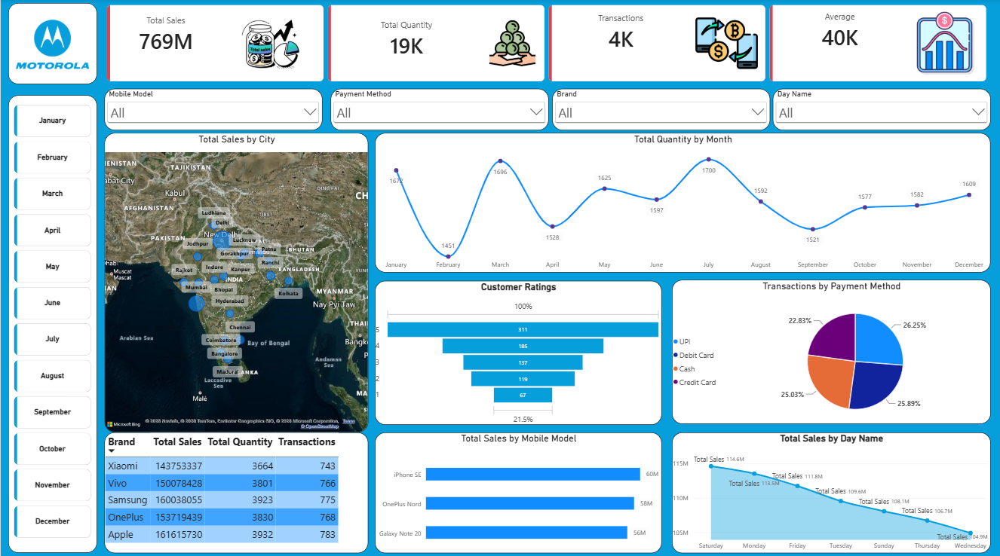

# 📊 Sales Analysis Dashboard – Power BI

An interactive sales dashboard developed using Microsoft Power BI
to analyze sales performance, quantity, transactions, customer ratings,
payment methods, brands, mobile models, cities, and monthly trends.

## 📸 Dashboard Preview

## 🛠️ Tools & Technologies

- Microsoft Power BI
- Power Query
- DAX
- Data Visualization
- Data Cleaning

## 📈 Dashboard Features

- Total Sales
- Total Quantity
- Total Transactions
- Average Sales
- Sales by City
- Monthly Quantity Trends
- Customer Ratings
- Transactions by Payment Method
- Sales by Mobile Model
- Sales by Day Name
- Brand-wise Sales Analysis

## 🔍 Key Insights

- Samsung, OnePlus and Apple contribute significantly to total sales.
- Sales and quantity vary across different months.
- UPI and Debit Card are major payment methods.
- Mobile models show different sales performance.

## 📁 Files

- `Sales_Dashboard.pbix` – Power BI dashboard
- `Dashboard.png` – Dashboard preview
- `Dataset/` – Dataset used for analysis

## 👩‍💻 Author

Rimjhim
